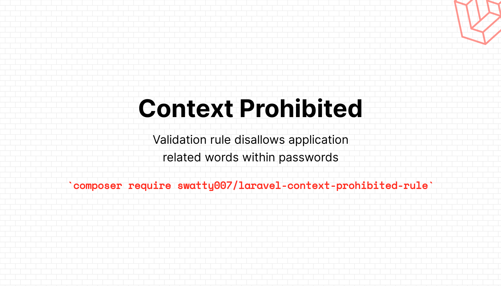

# Context prohibited validation rule for Laravel



[](https://packagist.org/packages/swatty007/laravel-context-prohibited-rule)
[](https://opensource.org/licenses/MIT)
[](https://www.travis-ci.com/swatty007/laravel-context-prohibited-rule)
[](https://github.styleci.io/repos/339864266?branch=main)
[](https://scrutinizer-ci.com/g/swatty007/laravel-context-prohibited-rule)
[](https://packagist.org/packages/swatty007/laravel-context-prohibited-rule)

Simple validation rule to disallow application related words within passwords. 
Its checks that the entered data does not contain your application name, or url to prevent users weakening their passwords.

## Installation

You can install the package via composer:

```bash
composer require swatty007/laravel-context-prohibited-rule
```
Laravel's service provider discovery will automatically configure our service provider for you.

Add the validation message to your validation lang file:

For each language add a validation message to **validation.php** like below
```php
'context_prohibited' => 'Your :attribute shall not contain any of the following words: :prohibited',
```

## Configuration

After installing the package you can publish the configuration file via:
```php
php artisan vendor:publish --provider="Swatty007\LaravelContextProhibitedRule\ContextProhibitedServiceProvider"
```
It contains some optional configuration parameters and is fully documented.

## Usage
After installation, the ```php context_prohibited ``` validator will be available for use directly in your validation rules.
```php
'password' => 'context_prohibited'
// or preferred
'password' => ['required', new ContextProhibited],
```
> For error message to work correctly you should prefer to initialize the rule object!

Within the context of a registration form, it would look like this:
```php
return Validator::make($data, [
    'name' => 'required|string|max:255',
    'email' => 'required|string|email|max:255|unique:users',
    'password' => 'required|string|min:8|context_prohibited|confirmed',
]);
```

### Testing
Yes we do!
``` bash
composer test
```

### Changelog

Please see [CHANGELOG](CHANGELOG.md) for more information what has changed recently.

## TODO

- Currently None

Pull Requests are welcome :monocle_face:

## Contributing

Please see [CONTRIBUTING](CONTRIBUTING.md) for details.

### Security

If you discover any security related issues, please email info@martin-niehoff.de instead of using the issue tracker.

## Credits

- [Martin Niehoff](https://github.com/swatty007)
- [All Contributors](../../contributors)

## License

The MIT License (MIT). Please see [License File](LICENSE.md) for more information.
